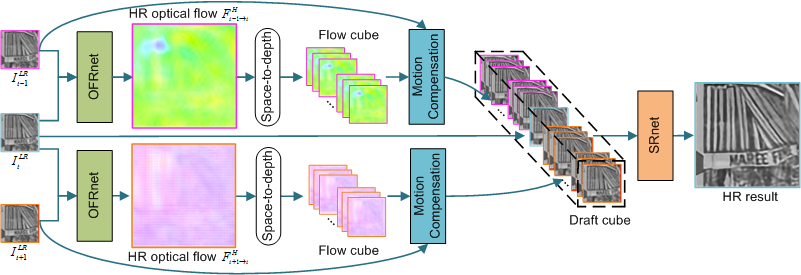
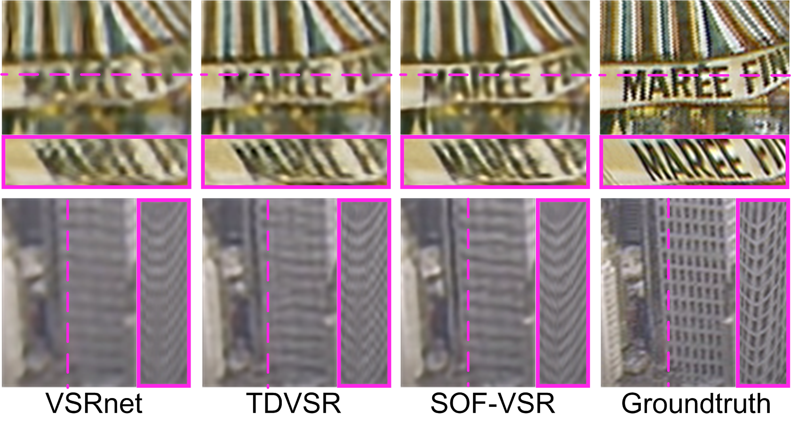

# SOF-VSR (Super-resolving Optical Flow for Video Super-Resolution)
Pytorch implementation of "Learning for Video Super-Resolution through HR Optical Flow Estimation", ACCV 2018.

[[arXiv]](http://arxiv.org/abs/1809.08573)

## Overview

Over view of our SOF-VSR network.

Comparison with the state-of-the-arts.

## Requirements
- Python 3
- pytorch (0.4), torchvision (0.2)
- numpy, PIL
- Matlab (For PSNR/SSIM evaluation)

## Datasets
We use the Vid4 dataset and a subset of the DAVIS dataset (namely, DAVIS-10) for benchmark test.
- [Vid4]()
- [DAVIS-10](https://davischallenge.org/)  
We use 10 scenes in the DAVIS-2017 test set including boxing, demolition, dive-in, dog-control, dolphins, kart-turn, ocean-birds, pole-vault, speed-skating and wings-trun.

## Test
We provide the pretrained model for 4x SR. Note that we made some modifications to the original code and it should produce comparable or even better results.
```bash
python demo_Vid4.py --video_name calendar --upscale_factor 4
```
You can download [Vid4]() dataset and unzip in `data` directory. Then you can test our network on other scenes.
## Results

## Citation
```
@InProceedings{tao2017spmc,
  author    = {Xin Tao and
               Hongyun Gao and
               Renjie Liao and
               Jue Wang and
               Jiaya Jia},
  title = {Detail-Revealing Deep Video Super-Resolution},
  booktitle = {The IEEE International Conference on Computer Vision (ICCV)},
  month = {Oct},
  year = {2017}
}
```
## Contact
